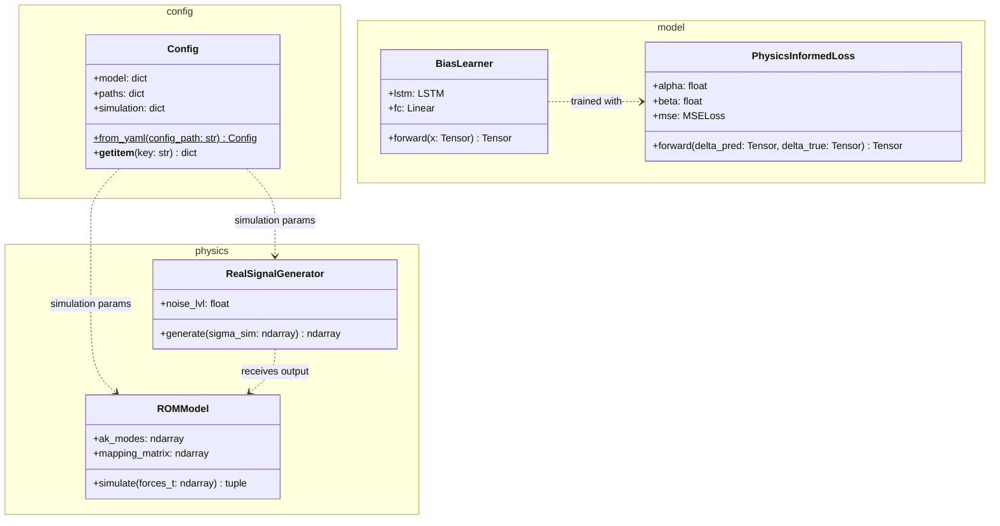
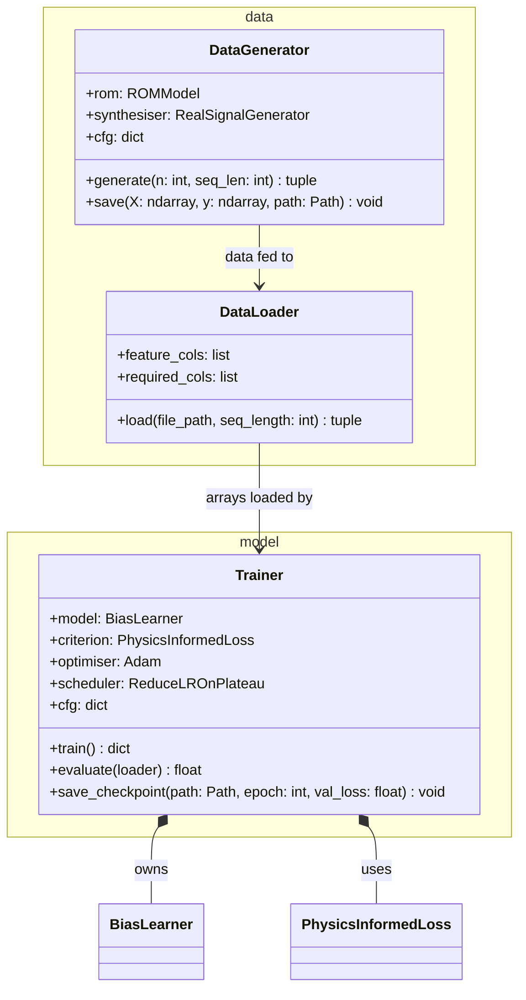
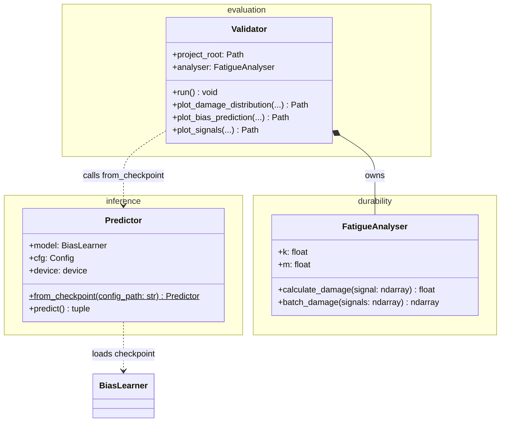

# Hybrid Twin — Class Diagrams

## 1. Core Domain Layer

```mermaid
classDiagram
  namespace config {
    class Config {
      +model: dict
      +paths: dict
      +simulation: dict
      +from_yaml(config_path: str) Config$
      +__getitem__(key: str) dict
    }
  }

  namespace physics {
    class ROMModel {
      +ak_modes: ndarray
      +mapping_matrix: ndarray
      +simulate(forces_t: ndarray) tuple
    }
    class RealSignalGenerator {
      +noise_lvl: float
      +generate(sigma_sim: ndarray) ndarray
    }
  }

  namespace model {
    class BiasLearner {
      +lstm: LSTM
      +fc: Linear
      +forward(x: Tensor) Tensor
    }
    class PhysicsInformedLoss {
      +alpha: float
      +beta: float
      +mse: MSELoss
      +forward(delta_pred: Tensor, delta_true: Tensor) Tensor
    }
  }

  Config ..> ROMModel : simulation params
  Config ..> RealSignalGenerator : simulation params
  RealSignalGenerator ..> ROMModel : receives output
  BiasLearner ..> PhysicsInformedLoss : trained with
```

---

## 2. Data & Training Pipeline

```mermaid
classDiagram
  namespace data {
    class DataGenerator {
      +rom: ROMModel
      +synthesiser: RealSignalGenerator
      +cfg: dict
      +generate(n: int, seq_len: int) tuple
      +save(X: ndarray, y: ndarray, path: Path) void
    }
    class DataLoader {
      +feature_cols: list
      +required_cols: list
      +load(file_path, seq_length: int) tuple
    }
  }

  namespace model {
    class Trainer {
      +model: BiasLearner
      +criterion: PhysicsInformedLoss
      +optimiser: Adam
      +scheduler: ReduceLROnPlateau
      +cfg: dict
      +train() dict
      +evaluate(loader) float
      +save_checkpoint(path: Path, epoch: int, val_loss: float) void
    }
  }

  DataGenerator --> DataLoader : data fed to
  DataLoader --> Trainer : arrays loaded by
  Trainer *-- BiasLearner : owns
  Trainer *-- PhysicsInformedLoss : uses
```

---

## 3. Inference & Evaluation Layer

```mermaid
classDiagram
  namespace inference {
    class Predictor {
      +model: BiasLearner
      +cfg: Config
      +device: device
      +from_checkpoint(config_path: str) Predictor$
      +predict() tuple
    }
  }

  namespace durability {
    class FatigueAnalyser {
      +k: float
      +m: float
      +calculate_damage(signal: ndarray) float
      +batch_damage(signals: ndarray) ndarray
    }
  }

  namespace evaluation {
    class Validator {
      +project_root: Path
      +analyser: FatigueAnalyser
      +run() void
      +plot_damage_distribution(...) Path
      +plot_bias_prediction(...) Path
      +plot_signals(...) Path
    }
  }

  Predictor ..> BiasLearner : loads checkpoint
  Validator ..> Predictor : calls from_checkpoint
  Validator *-- FatigueAnalyser : owns
```